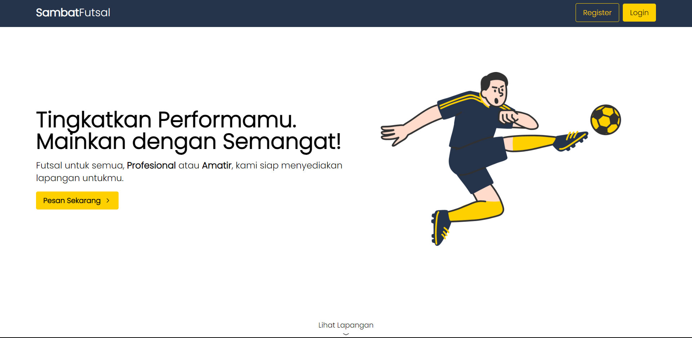

# Sambat Futsal Overview

"Sambat Futsal" adalah aplikasi berbasis web yang bertujuan menyediakan platform praktis dan efisien untuk penyewaan lapangan futsal. Dengan desain yang ramah pengguna, website ini memungkinkan pelanggan untuk melakukan pemesanan lapangan secara online, melihat ketersediaan waktu, mengetahui harga sewa, dan melakukan pembayaran. Selain itu, pemilik lapangan dapat mengelola jadwal dan melacak pembayaran dengan lebih efisien, meningkatkan operasional bisnis penyewaan lapangan futsal "Sambat Futsal".

## Cara Menjalankan Webapp

Untuk menjalankan webapp berbasis, buka directory project lalu buka terminal, kemudian ikuti langkah berikut:

1. **Install Dependencies:**
   ```bash
   npm install
   ```

2. **Run Development Server:**
   ```bash
   npm run dev
   ```
   Webapp akan dapat diakses di `http://localhost:3000`.

## Daftar Use Case

### 1. UC1 - Landing Page
- **NIM:** 18221162
- **Nama:** Ceavin Rufus De Prayer Purba
- Halaman awal sistem reservasi lapangan futsal menampilkan informasi tentang sistem, lapangan futsal yang tersedia, dan opsi login atau registrasi.


### 2. UC2 - Register
- **NIM:** 18221162
- **Nama:** Ceavin Rufus De Prayer Purba
- User diharuskan mengisi informasi pribadi seperti nama, email, dan password untuk membuat akun.

### 3. UC3 - Login
- **NIM:** 18221162
- **Nama:** Ceavin Rufus De Prayer Purba
- User login dengan informasi pribadi yang terdaftar dan mendapatkan akses sesuai dengan rolenya.

### 4. UC4 - Melihat Laporan Keuangan
- **NIM:** 18221072
- **Nama:** Hilmi Baskara Radanto
- Menampilkan laporan keuangan dengan detail pendapatan, pengeluaran, dan laba/rugi.

### 5. UC5 - Memesan Lapangan
- **NIM:** 18221162
- **Nama:** Ceavin Rufus De Prayer Purba
- User memilih tanggal, waktu, dan lapangan untuk melakukan reservasi.

### 6. UC6 - Melihat Daftar Lapangan
- **NIM:** 18221146
- **Nama:** Tara Chandani Haryono
- Menampilkan katalog lapangan beserta informasi seperti nama, harga sewa, jadwal, dan ketersediaan.

### 7. UC7 - Mengelola Lapangan
- **NIM:** 18221146
- **Nama:** Tara Chandani Haryono
- Admin dapat membuat, mengubah, dan menghapus informasi lapangan seperti nama, harga sewa, jadwal, dan ketersediaan.

### 8. UC8 - Mengelola Pesanan
- **NIM:** 18221138
- **Nama:** Muhamad Pedro
- Admin dapat mengatur informasi reservasi lapangan, termasuk membuat, mengubah, dan menghapus data reservasi.

### 9. UC9 - Melihat Riwayat Pemesanan
- **NIM:** 18221138
- **Nama:** Muhamad Pedro
- Menampilkan riwayat pemesanan pelanggan dengan detail tanggal, waktu, dan lapangan yang digunakan.

### 10. UC10 - Mengelola Akun
- **NIM:** 18221072
- **Nama:** Hilmi Baskara Radanto
- Pengguna memiliki kontrol penuh atas akun mereka.

## Daftar Tabel Basis Data

### Diagram Database
[insert image]

1. **Tabel `field_schedule`**
   - `field_id`: string
   - `date`: date
   - `time`: time
   - `available`: bool

2. **Tabel `fields`**
   - `type`: varchar
   - `harga_weekday`: int4
   - `harga_weekend`: int4
   - `no_lapangan`: int2
   - `id`: uuid

3. **Tabel `reservations`**
   - `reservation_id`: uuid
   - `reserver_id`: uuid
   - `date`: date
   - `total_price`: int4
   - `no_lapangan`: int2
   - `booking_code`: bpchar
   - `payment_proof`: text
   - `time`: time
   - `duration`: int2
   - `payment_date`: date

4. **Tabel `profiles`**
   - `id`: uuid
   - `created_at`: timetamptz
   - `full_name`: varchar
   - `avatar`: text
   - `gender`: varchar
   - `role`: varchar
   - `phone`: varchar
   - `birthdate`: date
